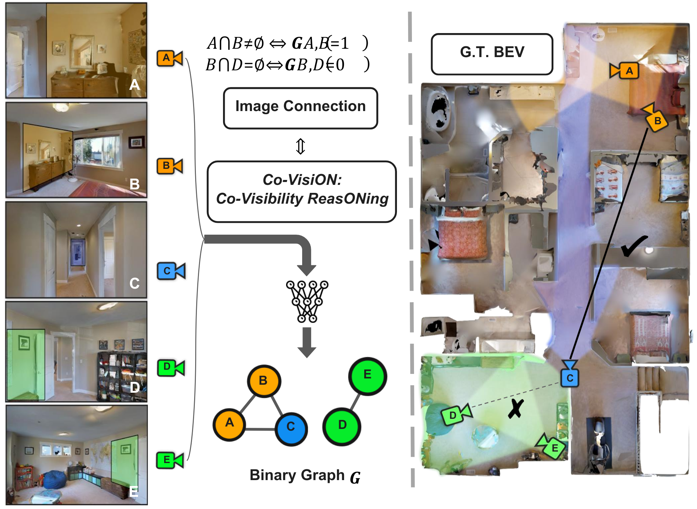

# Co-VisiON: Co-Visibility ReasONing on Sparse Image Sets of Indoor Scenes
This is the official implementation of 
>[CoVISION](https://ai4ce.github.io/CoVISION/) 
>
>Chao Chen, Nobel Dang, Juexiao Zhang, Wenkai Sun, Pengfei Zheng, Xuhang He, Yimeng Ye, Taarun Srinivas and Chen Feng
>
> New York University

### [**[Project page]**](https://ai4ce.github.io/CoVISION) **|** [**[Paper]**](TBD)





## Implementations
### Requirements

First, setup the environment by running
```shell
git clone https://github.com/ai4ce/CoVISION.git
cd CoVISION
conda create --name covision python=3.9
conda activate covision
pip install -r requirements.txt
```

### Dataset
You can download the Co-VisiON dataset (.tar.gz) from huggingface directly by running:

```shell
python hf_download_data.py
```
This should download both the HM3D and Gibson datasets. Untar all the dataset files and it should give you a structured directory with subdirectories as:

```bash
└── CoVISION/
    ├── gvgg/                   # gibson dataset
    │   ├── temp/
    │   │    ├──More_vis/       # contains the RGB based best_color*.png files with rel_mats
    │   │    └──batch_idx/
    └── hvgg/                   # HM3D dataset
        └──temp/
            ├──More_vis/        # contains the RGB based best_color*.png files with rel_mats
            └──batch_idx/

```

For dataset generation and its code, please refer to our data_generation branch.

### Inference
TBD

### Training our Covis method
For mvdust3r implementation, please refer to our Covis branch.
